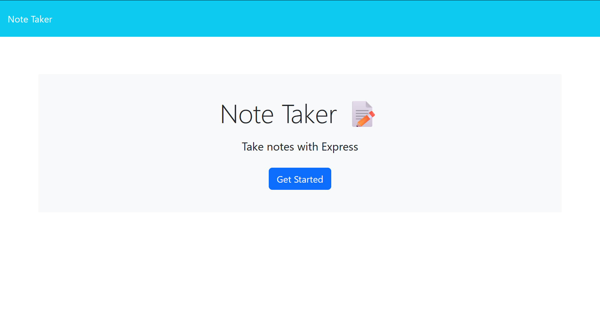

# Note Taker

## Description

A text note taking app whose backend I created to practice Express.js

Uses:

- <http://expressjs.com/>
- <https://nodejs.org/>

## Table of Contents

- [Installation](#installation)
- [Usage](#usage)
- [License](#license)
- [Contributing](#contributing)
- [Tests](#tests)
- [Questions](#questions)

## Installation

Already deployed at <https://note-taker-lsmcd-a2be44bdce42.herokuapp.com/>, alternatively:
Download the project and in the root directory run "npm init -y" and "npm i"

## Usage

Run the command "node server.js" in the root directory, and go to the website "localhost:3001"

## License

No applicable license
Fork of: <https://github.com/coding-boot-camp/miniature-eureka>

## Contributing

No contributions at this time

## Tests

No tests

## Questions

Please contact: <https://github.com/lsmcd>  
Or reach out by email: <lsmcd@pm.me>
